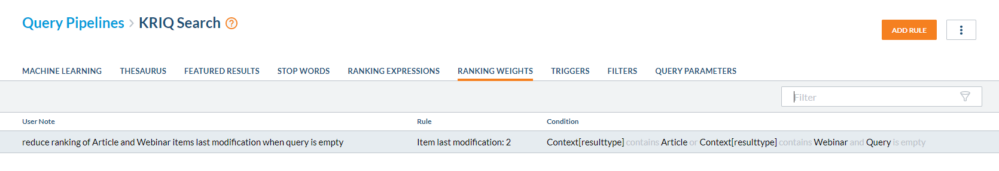
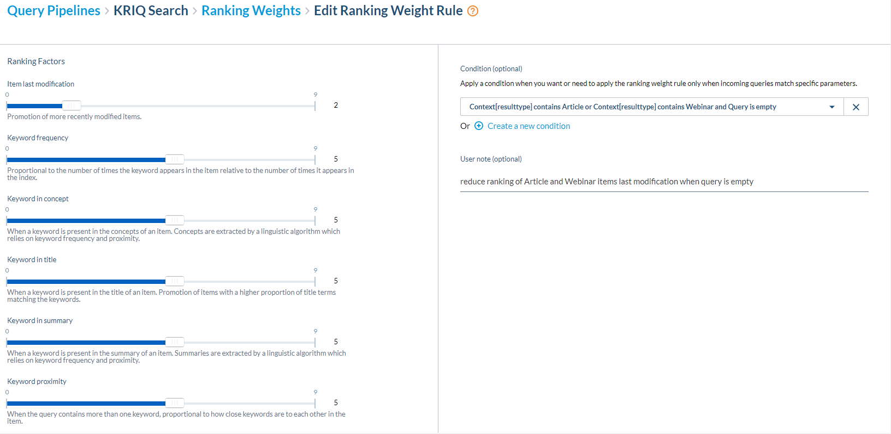
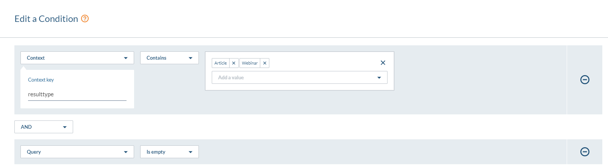
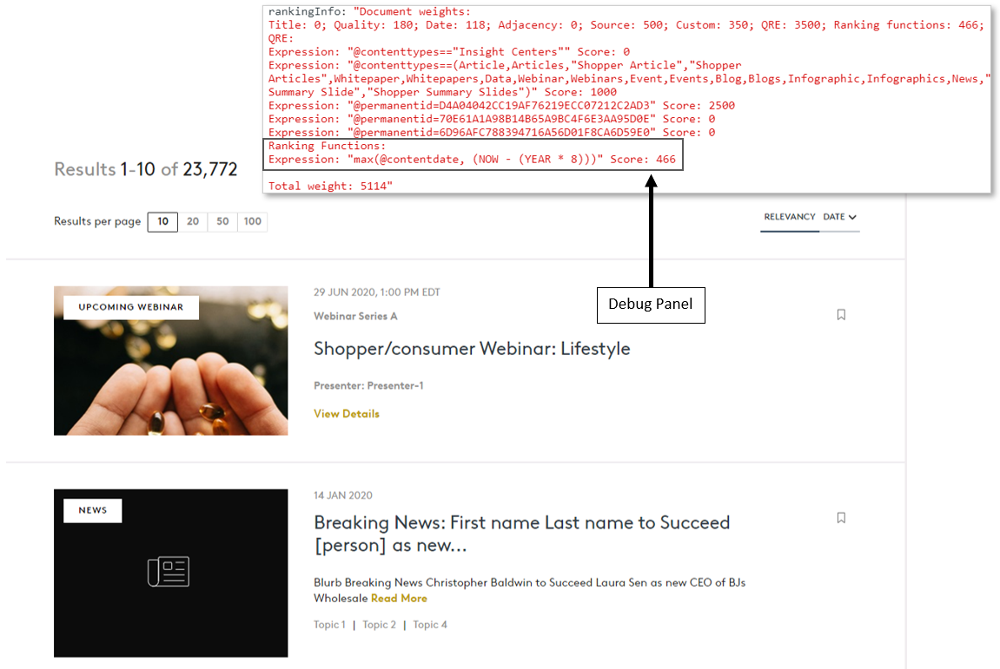

The Coveo ART Model ranking system can provide your search hub with a fresh set of relevant results further curated by Usage Analytics. When it comes to migrated content that has been disconnected from previously held historical data, this ranking system will be reluctant to know these analytical trends, and therefore there is a need to adjust ranking manually.

## The Use Case
In a typical content migration you may carry over certain data to Sitecore that pertains to the UI behavior, such as a _Publication Date_ for Articles and an _End Date_ for Webinars. These values may be used hand in hand as sort criteria for Coveo as a single computed field, such as _contentdate_. When all of this content has been imported to Sitecore, the statistics field section _Updated_ Date field may not be set to the true Date of when that piece of content was last modified due to the nature of content being created and the statistics being automatically updated on `item::save` events. The import of items can be customized to set the same value in the _Updated_ field and then skip updating statistics, but that runs the risk of re-modifying a system field used to append the item to the publishing queue based on timestamps. I would recommend importing items in ascending order at this point.

With content imported, you'll notice that an Article from 2012 has a similar last updated value as an Article that is less than a few weeks old. And this may be no different than what you see in the UI - **especially when a Coveo Search Interface is loaded with relevancy and no query**. This is due to Coveo's ranking of documents.

## Coveo Ranking in our Use Case
Relevancy heavily relies on two Coveo Ranking Phases called _Term Weighting_ and _Term Frequency & Adjaceny_. These phases have important factors that are only used when a search query is applied. Without term ranking boosting relevancy, we are left with the _Document Weighting_ phase, where one if it's ranking factors, _Date (Item last modification)_, plays a crucial role in ranking Items higher with the most recent modification date. This is not to say that a content item _will_ be ranked higher, but a higher total score could be achieved. Due to the out-of-the-box  _Document Weighting_, we find ourselves viewing too many irrelenvant articles and Past Webinars.

<svg style="left: 0px; top: 0px; margin: 0 auto; height: 100%; display: block; min-width: 735px; min-height: 750px; background-color: transparent; background-image: none;"><defs><filter id="dropShadow"><feGaussianBlur in="SourceAlpha" stdDeviation="1.7" result="blur"></feGaussianBlur><feOffset in="blur" dx="3" dy="3" result="offsetBlur"></feOffset><feFlood flood-color="#3D4574" flood-opacity="0.4" result="offsetColor"></feFlood><feComposite in="offsetColor" in2="offsetBlur" operator="in" result="offsetBlur"></feComposite><feBlend in="SourceGraphic" in2="offsetBlur"></feBlend></filter></defs><g transformOrigin="0 0" transform="scale(0.99,0.99)translate(-22,-267)"><g></g><g><g transform="translate(0.5,0.5)" style="visibility: visible;"><rect x="30" y="277" width="720" height="733" fill="#ffffff" stroke="none" pointer-events="all"></rect></g><g transform="translate(0.5,0.5)" style="visibility: visible;"><path d="M 220 990 L 292 428 L 508 428 L 580 990 Z" fill="#ffffff" stroke="#004990" stroke-width="3" stroke-miterlimit="10" transform="rotate(180,400,709)" pointer-events="all"></path></g><g style="visibility: visible;"><ellipse cx="85" cy="481" rx="30" ry="30" fill="#ffffff" stroke="#004990" stroke-width="4" pointer-events="all"></ellipse></g><g style="visibility: visible;"><ellipse cx="85" cy="626.5" rx="30" ry="30" fill="#ffffff" stroke="#004990" stroke-width="4" pointer-events="all"></ellipse></g><g style="visibility: visible;"><image x="68.5" y="682.5" width="32" height="29" xlink:href="data:image/png;base64,iVBORw0KGgoAAAANSUhEUgAAACwAAAAoCAYAAACFFRgXAAAKw2lDQ1BJQ0MgUHJvZmlsZQAASImVlwdYU1kWgO976Y0WCEVK6L23AFJCD6BEOtgISSChhJgQVOzI4AiOBRERVBQdFFBwLICMFQtWFBSwT5BBRRkHCzZU9gFLmNn9dvfb876b87+Tc8859373ft95AFDwHLE4E1YBIEuUI4kK8acnJCbRcf0ADfQABZAAg8OViplsdgRAZEr/XT70AGhc37Edj/Xv//9XUeXxpVwAIDbCKTwpNwvh48h4zRVLcgBA7UfsxotzxON8BWF1CVIgwo/GOW2Sh8c5ZYLR6AmfmKgAhLUAwJM5HEkaAGQTxE7P5aYhcciBCDuIeEIRwsg78OEKODyEkbzAJisre5zlCFuk/CVO2t9ipihicjhpCp5cy4TgA4VScSZn6f+5Hf9bsjJlUznMkEEWSEKjEE1D9uxeRna4gkUpsyOnWMib8J9ggSw0doq50oCkKeZxAsMVczNnR0xxqjCYpYiTw4qZYr40KHqKJdlRilypkgDmFHMk03llGbEKu4DPUsTPE8TET3GuMG72FEszosOnfQIUdoksSlE/XxTiP503WLH2LOlf1itkKebmCGJCFWvnTNfPFzGnY0oTFLXx+IFB0z6xCn9xjr8ilziTrfDnZ4Yo7NLcaMXcHORATs9lK/YwnRPGnmIQCIJABPLQARs4ARfgiPwi1ebwl4yfURCQLV4qEaYJcuhM5Jbx6SwR186G7uTg6AHA+J2dPBLv7k3cRYiGn7bN7wLAfgtiLJ22ZWsC0IZHjo902mY5BIBSKgCXzLgySe6kbfw6AQwgAmWgDrSBPjAGFsAWqcwNeAE/pOIwEAliQCJYALhAALKABCwGy8EaUAiKwWawDVSAKrAPHASHwVHQDE6B8+AyuA5ug27wEMjBAHgFhsEHMApBEA6iQFRIGzKATCFryAliQD5QEBQBRUGJUDKUBokgGbQcWgsVQyVQBbQXqoV+gU5C56GrUCd0H+qDBqG30BcYBZNhdVgPNoPtYQbMhMPhGHg+nAYvgvPgAngjXA5Xw4fgJvg8fB3uhuXwK3gEBVAkFA1liLJFMVABqEhUEioVJUGtRBWhylDVqAZUK6oddQclRw2hPqOxaCqajrZFe6FD0bFoLnoReiV6A7oCfRDdhL6IvoPuQw+jv2MoGF2MNcYTw8IkYNIwizGFmDJMDeYE5hKmGzOA+YDFYmlYc6w7NhSbiE3HLsNuwO7CNmLPYTux/dgRHA6njbPGeeMicRxcDq4QtwN3CHcW14UbwH3Ck/AGeCd8MD4JL8Ln48vwdfgz+C78c/woQYVgSvAkRBJ4hKWETYT9hFbCLcIAYZSoSjQnehNjiOnENcRyYgPxEvER8R2JRDIieZDmkISk1aRy0hHSFVIf6TNZjWxFDiDPI8vIG8kHyOfI98nvKBSKGcWPkkTJoWyk1FIuUJ5QPilRleyUWEo8pVVKlUpNSl1Kr5UJyqbKTOUFynnKZcrHlG8pD6kQVMxUAlQ4KitVKlVOqvSqjKhSVR1VI1WzVDeo1qleVX2hhlMzUwtS46kVqO1Tu6DWT0VRjakBVC51LXU/9RJ1QB2rbq7OUk9XL1Y/rN6hPqyhpuGiEaexRKNS47SGnIaimdFYtEzaJtpRWg/ti6aeJlOTr7les0GzS/Oj1gwtPy2+VpFWo1a31hdtunaQdob2Fu1m7cc6aB0rnTk6i3V261zSGZqhPsNrBndG0YyjMx7owrpWulG6y3T36d7QHdHT1wvRE+vt0LugN6RP0/fTT9cv1T+jP2hANfAxEBqUGpw1eEnXoDPpmfRy+kX6sKGuYaihzHCvYYfhqJG5UaxRvlGj0WNjojHDONW41LjNeNjEwGSWyXKTepMHpgRThqnAdLtpu+lHM3OzeLN1Zs1mL8y1zFnmeeb15o8sKBa+Fossqi3uWmItGZYZlrssb1vBVq5WAqtKq1vWsLWbtdB6l3WnDcbGw0ZkU23Ta0u2Zdrm2tbb9tnR7CLs8u2a7V7bm9gn2W+xb7f/7uDqkOmw3+Gho5pjmGO+Y6vjWycrJ65TpdNdZ4pzsPMq5xbnNy7WLnyX3S73XKmus1zXuba5fnNzd5O4NbgNupu4J7vvdO9lqDPYjA2MKx4YD3+PVR6nPD57unnmeB71/NPL1ivDq87rxUzzmfyZ+2f2ext5c7z3est96D7JPnt85L6Gvhzfat+nfsZ+PL8av+dMS2Y68xDztb+Dv8T/hP/HAM+AFQHnAlGBIYFFgR1BakGxQRVBT4KNgtOC64OHQ1xDloWcC8WEhoduCe1l6bG4rFrWcJh72Iqwi+Hk8OjwivCnEVYRkojWWfCssFlbZz2abTpbNLs5EkSyIrdGPmabsxexf52DncOeUznnWZRj1PKo9mhq9MLouugPMf4xm2IexlrEymLb4pTj5sXVxn2MD4wviZcn2CesSLieqJMoTGxJwiXFJdUkjcwNmrtt7sA813mF83rmm89fMv/qAp0FmQtOL1ReyFl4LBmTHJ9cl/yVE8mp5oyksFJ2pgxzA7jbua94frxS3iDfm1/Cf57qnVqS+iLNO21r2qDAV1AmGBIGCCuEb9JD06vSP2ZEZhzIGMuMz2zMwmclZ50UqYkyRBez9bOXZHeKrcWFYvkiz0XbFg1LwiU1Ukg6X9qSo440RzdkFrIfZH25PrmVuZ8Wxy0+tkR1iWjJjaVWS9cvfZ4XnPfzMvQy7rK25YbL1yzvW8FcsXcltDJlZdsq41UFqwZWh6w+uIa4JmPNzXyH/JL892vj17YW6BWsLuj/IeSH+kKlQklh7zqvdVU/on8U/tix3nn9jvXfi3hF14odisuKv27gbrj2k+NP5T+NbUzd2LHJbdPuzdjNos09W3y3HCxRLckr6d86a2tTKb20qPT9toXbrpa5lFVtJ26XbZeXR5S37DDZsXnH1wpBRXelf2XjTt2d63d+3MXb1bXbb3dDlV5VcdWXPcI99/aG7G2qNqsu24fdl7vv2f64/e0/M36urdGpKa75dkB0QH4w6uDFWvfa2jrduk31cL2sfvDQvEO3DwcebmmwbdjbSGssPgKOyI68/CX5l56j4UfbjjGONRw3Pb7zBPVEURPUtLRpuFnQLG9JbOk8GXayrdWr9cSvdr8eOGV4qvK0xulNZ4hnCs6Mnc07O3JOfG7ofNr5/raFbQ8vJFy4e3HOxY5L4ZeuXA6+fKGd2X72iveVU1c9r568xrjWfN3tetMN1xsnbrrePNHh1tF0y/1Wy22P262dMzvPdPl2nb8TeOfyXdbd692zuzt7Ynvu9c7rld/j3XtxP/P+mwe5D0Yfrn6EeVT0WOVx2RPdJ9W/Wf7WKHeTn+4L7LvxNPrpw35u/6vfpb9/HSh4RnlW9tzgee0LpxenBoMHb7+c+3LglfjV6FDhH6p/7Hxt8fr4n35/3hhOGB54I3kz9nbDO+13B967vG8bYY88+ZD1YfRj0SftTwc/Mz63f4n/8nx08Vfc1/Jvlt9av4d/fzSWNTYm5kg4E60AChlwKtIfvD0AACURAOptAIhzJ3vqCYEmvwMmCPwnnuy7J8QNgJrVAMT6IQN5rULYAmEKotmIjvEDsLOzYvxTpKnOTpOxSM1Ia1I2NvYO6R9xlgB86x0bG20eG/tWgxT7AIBzHyZ7+XFROQTAnhUuIezYm8brwL/KPwBrnxBOCt7FPwAAAZtpVFh0WE1MOmNvbS5hZG9iZS54bXAAAAAAADx4OnhtcG1ldGEgeG1sbnM6eD0iYWRvYmU6bnM6bWV0YS8iIHg6eG1wdGs9IlhNUCBDb3JlIDUuNC4wIj4KICAgPHJkZjpSREYgeG1sbnM6cmRmPSJodHRwOi8vd3d3LnczLm9yZy8xOTk5LzAyLzIyLXJkZi1zeW50YXgtbnMjIj4KICAgICAgPHJkZjpEZXNjcmlwdGlvbiByZGY6YWJvdXQ9IiIKICAgICAgICAgICAgeG1sbnM6ZXhpZj0iaHR0cDovL25zLmFkb2JlLmNvbS9leGlmLzEuMC8iPgogICAgICAgICA8ZXhpZjpQaXhlbFhEaW1lbnNpb24+NDQ8L2V4aWY6UGl4ZWxYRGltZW5zaW9uPgogICAgICAgICA8ZXhpZjpQaXhlbFlEaW1lbnNpb24+NDA8L2V4aWY6UGl4ZWxZRGltZW5zaW9uPgogICAgICA8L3JkZjpEZXNjcmlwdGlvbj4KICAgPC9yZGY6UkRGPgo8L3g6eG1wbWV0YT4KHWD/lAAAAjNJREFUWAnt2U1IG0EUB/B/ipZQCfhRRJHm4BeKWAMigh6MXgrFQ0XwJCKIHzfBW8VbvQmCiCKV0lxMQPGgFKtUPTSgIhiLEkQ9KAUrKoIVQUGqzji8S9yubHZmkxXn8tg3m7e/vOxMNsRxywZsNF7YyHpPfQar/sSeeIeX/cB2UHUTdesb73CgC5j4CJzs6RZWNWkczCXheWCoAVgYAv5dq7Jp1o0OTKWCPmDgAxCaoozyaA7MeefHwHQv4GsH9tdsACbifoihO4CpT+xNHFFWejTf4UjS+jS7TeqA4NfIGSnH8sGcxRfiwrBYmOEfUqBURA2YqvOtb6Ib8LOt8M8WZU1FtWCi7bAvm89NwGw/cHVB2aiiNWCirQTENrg6ThnD0Vow513+BWb6gNFmYHfJBmAiHoSBsU5gsgc4/U3ZR6P1HY4kbc4Bg/XA4ghwexM5++A49mAi/fwi7u9f3yijGeMHzHlnhwCHb3zXxPJkwn9nYjHhbQO8rbpXjg9wyXsGZdiULF0sn4wt+M1bAc0pfxRKJ8QGnJQqoGVsdzA4rAdXNIr79OUrg1RxunXgAq+AZuRHBaUXqQen5wLVbOUX1tA1TUV14ESn6Ggle0qTONSAS9kvDr5NuV5LpIpScsHZZQLq9kiHUkE54ORMAfXUUl1l0Ty4qkVgHdY8lkQPLn4noGluZd3UKmwcnFUkoHkVWvWU54yBnS6g1accpXcBx/N/HHrtkTBnzdKWAKUStgPfAXSHamqgGivnAAAAAElFTkSuQmCC" preserveAspectRatio="none" transform="rotate(90,84.5,697)"></image></g><g style="visibility: visible;"><image x="69" y="851.5" width="32" height="29" xlink:href="data:image/png;base64,iVBORw0KGgoAAAANSUhEUgAAACwAAAAoCAYAAACFFRgXAAAKw2lDQ1BJQ0MgUHJvZmlsZQAASImVlwdYU1kWgO976Y0WCEVK6L23AFJCD6BEOtgISSChhJgQVOzI4AiOBRERVBQdFFBwLICMFQtWFBSwT5BBRRkHCzZU9gFLmNn9dvfb876b87+Tc8859373ft95AFDwHLE4E1YBIEuUI4kK8acnJCbRcf0ADfQABZAAg8OViplsdgRAZEr/XT70AGhc37Edj/Xv//9XUeXxpVwAIDbCKTwpNwvh48h4zRVLcgBA7UfsxotzxON8BWF1CVIgwo/GOW2Sh8c5ZYLR6AmfmKgAhLUAwJM5HEkaAGQTxE7P5aYhcciBCDuIeEIRwsg78OEKODyEkbzAJisre5zlCFuk/CVO2t9ipihicjhpCp5cy4TgA4VScSZn6f+5Hf9bsjJlUznMkEEWSEKjEE1D9uxeRna4gkUpsyOnWMib8J9ggSw0doq50oCkKeZxAsMVczNnR0xxqjCYpYiTw4qZYr40KHqKJdlRilypkgDmFHMk03llGbEKu4DPUsTPE8TET3GuMG72FEszosOnfQIUdoksSlE/XxTiP503WLH2LOlf1itkKebmCGJCFWvnTNfPFzGnY0oTFLXx+IFB0z6xCn9xjr8ilziTrfDnZ4Yo7NLcaMXcHORATs9lK/YwnRPGnmIQCIJABPLQARs4ARfgiPwi1ebwl4yfURCQLV4qEaYJcuhM5Jbx6SwR186G7uTg6AHA+J2dPBLv7k3cRYiGn7bN7wLAfgtiLJ22ZWsC0IZHjo902mY5BIBSKgCXzLgySe6kbfw6AQwgAmWgDrSBPjAGFsAWqcwNeAE/pOIwEAliQCJYALhAALKABCwGy8EaUAiKwWawDVSAKrAPHASHwVHQDE6B8+AyuA5ug27wEMjBAHgFhsEHMApBEA6iQFRIGzKATCFryAliQD5QEBQBRUGJUDKUBokgGbQcWgsVQyVQBbQXqoV+gU5C56GrUCd0H+qDBqG30BcYBZNhdVgPNoPtYQbMhMPhGHg+nAYvgvPgAngjXA5Xw4fgJvg8fB3uhuXwK3gEBVAkFA1liLJFMVABqEhUEioVJUGtRBWhylDVqAZUK6oddQclRw2hPqOxaCqajrZFe6FD0bFoLnoReiV6A7oCfRDdhL6IvoPuQw+jv2MoGF2MNcYTw8IkYNIwizGFmDJMDeYE5hKmGzOA+YDFYmlYc6w7NhSbiE3HLsNuwO7CNmLPYTux/dgRHA6njbPGeeMicRxcDq4QtwN3CHcW14UbwH3Ck/AGeCd8MD4JL8Ln48vwdfgz+C78c/woQYVgSvAkRBJ4hKWETYT9hFbCLcIAYZSoSjQnehNjiOnENcRyYgPxEvER8R2JRDIieZDmkISk1aRy0hHSFVIf6TNZjWxFDiDPI8vIG8kHyOfI98nvKBSKGcWPkkTJoWyk1FIuUJ5QPilRleyUWEo8pVVKlUpNSl1Kr5UJyqbKTOUFynnKZcrHlG8pD6kQVMxUAlQ4KitVKlVOqvSqjKhSVR1VI1WzVDeo1qleVX2hhlMzUwtS46kVqO1Tu6DWT0VRjakBVC51LXU/9RJ1QB2rbq7OUk9XL1Y/rN6hPqyhpuGiEaexRKNS47SGnIaimdFYtEzaJtpRWg/ti6aeJlOTr7les0GzS/Oj1gwtPy2+VpFWo1a31hdtunaQdob2Fu1m7cc6aB0rnTk6i3V261zSGZqhPsNrBndG0YyjMx7owrpWulG6y3T36d7QHdHT1wvRE+vt0LugN6RP0/fTT9cv1T+jP2hANfAxEBqUGpw1eEnXoDPpmfRy+kX6sKGuYaihzHCvYYfhqJG5UaxRvlGj0WNjojHDONW41LjNeNjEwGSWyXKTepMHpgRThqnAdLtpu+lHM3OzeLN1Zs1mL8y1zFnmeeb15o8sKBa+Fossqi3uWmItGZYZlrssb1vBVq5WAqtKq1vWsLWbtdB6l3WnDcbGw0ZkU23Ta0u2Zdrm2tbb9tnR7CLs8u2a7V7bm9gn2W+xb7f/7uDqkOmw3+Gho5pjmGO+Y6vjWycrJ65TpdNdZ4pzsPMq5xbnNy7WLnyX3S73XKmus1zXuba5fnNzd5O4NbgNupu4J7vvdO9lqDPYjA2MKx4YD3+PVR6nPD57unnmeB71/NPL1ivDq87rxUzzmfyZ+2f2ext5c7z3est96D7JPnt85L6Gvhzfat+nfsZ+PL8av+dMS2Y68xDztb+Dv8T/hP/HAM+AFQHnAlGBIYFFgR1BakGxQRVBT4KNgtOC64OHQ1xDloWcC8WEhoduCe1l6bG4rFrWcJh72Iqwi+Hk8OjwivCnEVYRkojWWfCssFlbZz2abTpbNLs5EkSyIrdGPmabsxexf52DncOeUznnWZRj1PKo9mhq9MLouugPMf4xm2IexlrEymLb4pTj5sXVxn2MD4wviZcn2CesSLieqJMoTGxJwiXFJdUkjcwNmrtt7sA813mF83rmm89fMv/qAp0FmQtOL1ReyFl4LBmTHJ9cl/yVE8mp5oyksFJ2pgxzA7jbua94frxS3iDfm1/Cf57qnVqS+iLNO21r2qDAV1AmGBIGCCuEb9JD06vSP2ZEZhzIGMuMz2zMwmclZ50UqYkyRBez9bOXZHeKrcWFYvkiz0XbFg1LwiU1Ukg6X9qSo440RzdkFrIfZH25PrmVuZ8Wxy0+tkR1iWjJjaVWS9cvfZ4XnPfzMvQy7rK25YbL1yzvW8FcsXcltDJlZdsq41UFqwZWh6w+uIa4JmPNzXyH/JL892vj17YW6BWsLuj/IeSH+kKlQklh7zqvdVU/on8U/tix3nn9jvXfi3hF14odisuKv27gbrj2k+NP5T+NbUzd2LHJbdPuzdjNos09W3y3HCxRLckr6d86a2tTKb20qPT9toXbrpa5lFVtJ26XbZeXR5S37DDZsXnH1wpBRXelf2XjTt2d63d+3MXb1bXbb3dDlV5VcdWXPcI99/aG7G2qNqsu24fdl7vv2f64/e0/M36urdGpKa75dkB0QH4w6uDFWvfa2jrduk31cL2sfvDQvEO3DwcebmmwbdjbSGssPgKOyI68/CX5l56j4UfbjjGONRw3Pb7zBPVEURPUtLRpuFnQLG9JbOk8GXayrdWr9cSvdr8eOGV4qvK0xulNZ4hnCs6Mnc07O3JOfG7ofNr5/raFbQ8vJFy4e3HOxY5L4ZeuXA6+fKGd2X72iveVU1c9r568xrjWfN3tetMN1xsnbrrePNHh1tF0y/1Wy22P262dMzvPdPl2nb8TeOfyXdbd692zuzt7Ynvu9c7rld/j3XtxP/P+mwe5D0Yfrn6EeVT0WOVx2RPdJ9W/Wf7WKHeTn+4L7LvxNPrpw35u/6vfpb9/HSh4RnlW9tzgee0LpxenBoMHb7+c+3LglfjV6FDhH6p/7Hxt8fr4n35/3hhOGB54I3kz9nbDO+13B967vG8bYY88+ZD1YfRj0SftTwc/Mz63f4n/8nx08Vfc1/Jvlt9av4d/fzSWNTYm5kg4E60AChlwKtIfvD0AACURAOptAIhzJ3vqCYEmvwMmCPwnnuy7J8QNgJrVAMT6IQN5rULYAmEKotmIjvEDsLOzYvxTpKnOTpOxSM1Ia1I2NvYO6R9xlgB86x0bG20eG/tWgxT7AIBzHyZ7+XFROQTAnhUuIezYm8brwL/KPwBrnxBOCt7FPwAAAZtpVFh0WE1MOmNvbS5hZG9iZS54bXAAAAAAADx4OnhtcG1ldGEgeG1sbnM6eD0iYWRvYmU6bnM6bWV0YS8iIHg6eG1wdGs9IlhNUCBDb3JlIDUuNC4wIj4KICAgPHJkZjpSREYgeG1sbnM6cmRmPSJodHRwOi8vd3d3LnczLm9yZy8xOTk5LzAyLzIyLXJkZi1zeW50YXgtbnMjIj4KICAgICAgPHJkZjpEZXNjcmlwdGlvbiByZGY6YWJvdXQ9IiIKICAgICAgICAgICAgeG1sbnM6ZXhpZj0iaHR0cDovL25zLmFkb2JlLmNvbS9leGlmLzEuMC8iPgogICAgICAgICA8ZXhpZjpQaXhlbFhEaW1lbnNpb24+NDQ8L2V4aWY6UGl4ZWxYRGltZW5zaW9uPgogICAgICAgICA8ZXhpZjpQaXhlbFlEaW1lbnNpb24+NDA8L2V4aWY6UGl4ZWxZRGltZW5zaW9uPgogICAgICA8L3JkZjpEZXNjcmlwdGlvbj4KICAgPC9yZGY6UkRGPgo8L3g6eG1wbWV0YT4KHWD/lAAAAjNJREFUWAnt2U1IG0EUB/B/ipZQCfhRRJHm4BeKWAMigh6MXgrFQ0XwJCKIHzfBW8VbvQmCiCKV0lxMQPGgFKtUPTSgIhiLEkQ9KAUrKoIVQUGqzji8S9yubHZmkxXn8tg3m7e/vOxMNsRxywZsNF7YyHpPfQar/sSeeIeX/cB2UHUTdesb73CgC5j4CJzs6RZWNWkczCXheWCoAVgYAv5dq7Jp1o0OTKWCPmDgAxCaoozyaA7MeefHwHQv4GsH9tdsACbifoihO4CpT+xNHFFWejTf4UjS+jS7TeqA4NfIGSnH8sGcxRfiwrBYmOEfUqBURA2YqvOtb6Ib8LOt8M8WZU1FtWCi7bAvm89NwGw/cHVB2aiiNWCirQTENrg6ThnD0Vow513+BWb6gNFmYHfJBmAiHoSBsU5gsgc4/U3ZR6P1HY4kbc4Bg/XA4ghwexM5++A49mAi/fwi7u9f3yijGeMHzHlnhwCHb3zXxPJkwn9nYjHhbQO8rbpXjg9wyXsGZdiULF0sn4wt+M1bAc0pfxRKJ8QGnJQqoGVsdzA4rAdXNIr79OUrg1RxunXgAq+AZuRHBaUXqQen5wLVbOUX1tA1TUV14ESn6Ggle0qTONSAS9kvDr5NuV5LpIpScsHZZQLq9kiHUkE54ORMAfXUUl1l0Ty4qkVgHdY8lkQPLn4noGluZd3UKmwcnFUkoHkVWvWU54yBnS6g1accpXcBx/N/HHrtkTBnzdKWAKUStgPfAXSHamqgGivnAAAAAElFTkSuQmCC" preserveAspectRatio="none" transform="rotate(90,85,866)"></image></g><g style="visibility: visible;"><ellipse cx="85" cy="786" rx="30" ry="30" fill="#ffffff" stroke="#004990" stroke-width="4" pointer-events="all"></ellipse></g><g style="visibility: visible;"><ellipse cx="84.5" cy="942.5" rx="30" ry="30" fill="#ffffff" stroke="#004990" stroke-width="4" pointer-events="all"></ellipse></g><g style="visibility: visible;"><image x="69" y="535.5" width="32" height="29" xlink:href="data:image/png;base64,iVBORw0KGgoAAAANSUhEUgAAACwAAAAoCAYAAACFFRgXAAAKw2lDQ1BJQ0MgUHJvZmlsZQAASImVlwdYU1kWgO976Y0WCEVK6L23AFJCD6BEOtgISSChhJgQVOzI4AiOBRERVBQdFFBwLICMFQtWFBSwT5BBRRkHCzZU9gFLmNn9dvfb876b87+Tc8859373ft95AFDwHLE4E1YBIEuUI4kK8acnJCbRcf0ADfQABZAAg8OViplsdgRAZEr/XT70AGhc37Edj/Xv//9XUeXxpVwAIDbCKTwpNwvh48h4zRVLcgBA7UfsxotzxON8BWF1CVIgwo/GOW2Sh8c5ZYLR6AmfmKgAhLUAwJM5HEkaAGQTxE7P5aYhcciBCDuIeEIRwsg78OEKODyEkbzAJisre5zlCFuk/CVO2t9ipihicjhpCp5cy4TgA4VScSZn6f+5Hf9bsjJlUznMkEEWSEKjEE1D9uxeRna4gkUpsyOnWMib8J9ggSw0doq50oCkKeZxAsMVczNnR0xxqjCYpYiTw4qZYr40KHqKJdlRilypkgDmFHMk03llGbEKu4DPUsTPE8TET3GuMG72FEszosOnfQIUdoksSlE/XxTiP503WLH2LOlf1itkKebmCGJCFWvnTNfPFzGnY0oTFLXx+IFB0z6xCn9xjr8ilziTrfDnZ4Yo7NLcaMXcHORATs9lK/YwnRPGnmIQCIJABPLQARs4ARfgiPwi1ebwl4yfURCQLV4qEaYJcuhM5Jbx6SwR186G7uTg6AHA+J2dPBLv7k3cRYiGn7bN7wLAfgtiLJ22ZWsC0IZHjo902mY5BIBSKgCXzLgySe6kbfw6AQwgAmWgDrSBPjAGFsAWqcwNeAE/pOIwEAliQCJYALhAALKABCwGy8EaUAiKwWawDVSAKrAPHASHwVHQDE6B8+AyuA5ug27wEMjBAHgFhsEHMApBEA6iQFRIGzKATCFryAliQD5QEBQBRUGJUDKUBokgGbQcWgsVQyVQBbQXqoV+gU5C56GrUCd0H+qDBqG30BcYBZNhdVgPNoPtYQbMhMPhGHg+nAYvgvPgAngjXA5Xw4fgJvg8fB3uhuXwK3gEBVAkFA1liLJFMVABqEhUEioVJUGtRBWhylDVqAZUK6oddQclRw2hPqOxaCqajrZFe6FD0bFoLnoReiV6A7oCfRDdhL6IvoPuQw+jv2MoGF2MNcYTw8IkYNIwizGFmDJMDeYE5hKmGzOA+YDFYmlYc6w7NhSbiE3HLsNuwO7CNmLPYTux/dgRHA6njbPGeeMicRxcDq4QtwN3CHcW14UbwH3Ck/AGeCd8MD4JL8Ln48vwdfgz+C78c/woQYVgSvAkRBJ4hKWETYT9hFbCLcIAYZSoSjQnehNjiOnENcRyYgPxEvER8R2JRDIieZDmkISk1aRy0hHSFVIf6TNZjWxFDiDPI8vIG8kHyOfI98nvKBSKGcWPkkTJoWyk1FIuUJ5QPilRleyUWEo8pVVKlUpNSl1Kr5UJyqbKTOUFynnKZcrHlG8pD6kQVMxUAlQ4KitVKlVOqvSqjKhSVR1VI1WzVDeo1qleVX2hhlMzUwtS46kVqO1Tu6DWT0VRjakBVC51LXU/9RJ1QB2rbq7OUk9XL1Y/rN6hPqyhpuGiEaexRKNS47SGnIaimdFYtEzaJtpRWg/ti6aeJlOTr7les0GzS/Oj1gwtPy2+VpFWo1a31hdtunaQdob2Fu1m7cc6aB0rnTk6i3V261zSGZqhPsNrBndG0YyjMx7owrpWulG6y3T36d7QHdHT1wvRE+vt0LugN6RP0/fTT9cv1T+jP2hANfAxEBqUGpw1eEnXoDPpmfRy+kX6sKGuYaihzHCvYYfhqJG5UaxRvlGj0WNjojHDONW41LjNeNjEwGSWyXKTepMHpgRThqnAdLtpu+lHM3OzeLN1Zs1mL8y1zFnmeeb15o8sKBa+Fossqi3uWmItGZYZlrssb1vBVq5WAqtKq1vWsLWbtdB6l3WnDcbGw0ZkU23Ta0u2Zdrm2tbb9tnR7CLs8u2a7V7bm9gn2W+xb7f/7uDqkOmw3+Gho5pjmGO+Y6vjWycrJ65TpdNdZ4pzsPMq5xbnNy7WLnyX3S73XKmus1zXuba5fnNzd5O4NbgNupu4J7vvdO9lqDPYjA2MKx4YD3+PVR6nPD57unnmeB71/NPL1ivDq87rxUzzmfyZ+2f2ext5c7z3est96D7JPnt85L6Gvhzfat+nfsZ+PL8av+dMS2Y68xDztb+Dv8T/hP/HAM+AFQHnAlGBIYFFgR1BakGxQRVBT4KNgtOC64OHQ1xDloWcC8WEhoduCe1l6bG4rFrWcJh72Iqwi+Hk8OjwivCnEVYRkojWWfCssFlbZz2abTpbNLs5EkSyIrdGPmabsxexf52DncOeUznnWZRj1PKo9mhq9MLouugPMf4xm2IexlrEymLb4pTj5sXVxn2MD4wviZcn2CesSLieqJMoTGxJwiXFJdUkjcwNmrtt7sA813mF83rmm89fMv/qAp0FmQtOL1ReyFl4LBmTHJ9cl/yVE8mp5oyksFJ2pgxzA7jbua94frxS3iDfm1/Cf57qnVqS+iLNO21r2qDAV1AmGBIGCCuEb9JD06vSP2ZEZhzIGMuMz2zMwmclZ50UqYkyRBez9bOXZHeKrcWFYvkiz0XbFg1LwiU1Ukg6X9qSo440RzdkFrIfZH25PrmVuZ8Wxy0+tkR1iWjJjaVWS9cvfZ4XnPfzMvQy7rK25YbL1yzvW8FcsXcltDJlZdsq41UFqwZWh6w+uIa4JmPNzXyH/JL892vj17YW6BWsLuj/IeSH+kKlQklh7zqvdVU/on8U/tix3nn9jvXfi3hF14odisuKv27gbrj2k+NP5T+NbUzd2LHJbdPuzdjNos09W3y3HCxRLckr6d86a2tTKb20qPT9toXbrpa5lFVtJ26XbZeXR5S37DDZsXnH1wpBRXelf2XjTt2d63d+3MXb1bXbb3dDlV5VcdWXPcI99/aG7G2qNqsu24fdl7vv2f64/e0/M36urdGpKa75dkB0QH4w6uDFWvfa2jrduk31cL2sfvDQvEO3DwcebmmwbdjbSGssPgKOyI68/CX5l56j4UfbjjGONRw3Pb7zBPVEURPUtLRpuFnQLG9JbOk8GXayrdWr9cSvdr8eOGV4qvK0xulNZ4hnCs6Mnc07O3JOfG7ofNr5/raFbQ8vJFy4e3HOxY5L4ZeuXA6+fKGd2X72iveVU1c9r568xrjWfN3tetMN1xsnbrrePNHh1tF0y/1Wy22P262dMzvPdPl2nb8TeOfyXdbd692zuzt7Ynvu9c7rld/j3XtxP/P+mwe5D0Yfrn6EeVT0WOVx2RPdJ9W/Wf7WKHeTn+4L7LvxNPrpw35u/6vfpb9/HSh4RnlW9tzgee0LpxenBoMHb7+c+3LglfjV6FDhH6p/7Hxt8fr4n35/3hhOGB54I3kz9nbDO+13B967vG8bYY88+ZD1YfRj0SftTwc/Mz63f4n/8nx08Vfc1/Jvlt9av4d/fzSWNTYm5kg4E60AChlwKtIfvD0AACURAOptAIhzJ3vqCYEmvwMmCPwnnuy7J8QNgJrVAMT6IQN5rULYAmEKotmIjvEDsLOzYvxTpKnOTpOxSM1Ia1I2NvYO6R9xlgB86x0bG20eG/tWgxT7AIBzHyZ7+XFROQTAnhUuIezYm8brwL/KPwBrnxBOCt7FPwAAAZtpVFh0WE1MOmNvbS5hZG9iZS54bXAAAAAAADx4OnhtcG1ldGEgeG1sbnM6eD0iYWRvYmU6bnM6bWV0YS8iIHg6eG1wdGs9IlhNUCBDb3JlIDUuNC4wIj4KICAgPHJkZjpSREYgeG1sbnM6cmRmPSJodHRwOi8vd3d3LnczLm9yZy8xOTk5LzAyLzIyLXJkZi1zeW50YXgtbnMjIj4KICAgICAgPHJkZjpEZXNjcmlwdGlvbiByZGY6YWJvdXQ9IiIKICAgICAgICAgICAgeG1sbnM6ZXhpZj0iaHR0cDovL25zLmFkb2JlLmNvbS9leGlmLzEuMC8iPgogICAgICAgICA8ZXhpZjpQaXhlbFhEaW1lbnNpb24+NDQ8L2V4aWY6UGl4ZWxYRGltZW5zaW9uPgogICAgICAgICA8ZXhpZjpQaXhlbFlEaW1lbnNpb24+NDA8L2V4aWY6UGl4ZWxZRGltZW5zaW9uPgogICAgICA8L3JkZjpEZXNjcmlwdGlvbj4KICAgPC9yZGY6UkRGPgo8L3g6eG1wbWV0YT4KHWD/lAAAAjNJREFUWAnt2U1IG0EUB/B/ipZQCfhRRJHm4BeKWAMigh6MXgrFQ0XwJCKIHzfBW8VbvQmCiCKV0lxMQPGgFKtUPTSgIhiLEkQ9KAUrKoIVQUGqzji8S9yubHZmkxXn8tg3m7e/vOxMNsRxywZsNF7YyHpPfQar/sSeeIeX/cB2UHUTdesb73CgC5j4CJzs6RZWNWkczCXheWCoAVgYAv5dq7Jp1o0OTKWCPmDgAxCaoozyaA7MeefHwHQv4GsH9tdsACbifoihO4CpT+xNHFFWejTf4UjS+jS7TeqA4NfIGSnH8sGcxRfiwrBYmOEfUqBURA2YqvOtb6Ib8LOt8M8WZU1FtWCi7bAvm89NwGw/cHVB2aiiNWCirQTENrg6ThnD0Vow513+BWb6gNFmYHfJBmAiHoSBsU5gsgc4/U3ZR6P1HY4kbc4Bg/XA4ghwexM5++A49mAi/fwi7u9f3yijGeMHzHlnhwCHb3zXxPJkwn9nYjHhbQO8rbpXjg9wyXsGZdiULF0sn4wt+M1bAc0pfxRKJ8QGnJQqoGVsdzA4rAdXNIr79OUrg1RxunXgAq+AZuRHBaUXqQen5wLVbOUX1tA1TUV14ESn6Ggle0qTONSAS9kvDr5NuV5LpIpScsHZZQLq9kiHUkE54ORMAfXUUl1l0Ty4qkVgHdY8lkQPLn4noGluZd3UKmwcnFUkoHkVWvWU54yBnS6g1accpXcBx/N/HHrtkTBnzdKWAKUStgPfAXSHamqgGivnAAAAAElFTkSuQmCC" preserveAspectRatio="none" transform="rotate(90,85,550)"></image></g><g transform="translate(0.5,0.5)" style="visibility: visible;"><rect x="45" y="458.5" width="80" height="45" fill="none" stroke="white" pointer-events="stroke" visibility="hidden" stroke-width="19"></rect><rect x="45" y="458.5" width="80" height="45" fill="none" stroke="none" pointer-events="all"></rect></g><g style=""><g><foreignObject style="overflow: visible; text-align: left;" pointer-events="none" width="100%" height="100%"><div style="display: flex; align-items: unsafe center; justify-content: unsafe center; width: 78px; height: 1px; padding-top: 481px; margin-left: 46px;"><div style="box-sizing: border-box; font-size: 0; text-align: center; "><div style="display: inline-block; font-size: 12px; font-family: lato; color: #000000; line-height: 1.2; pointer-events: all; white-space: normal; word-wrap: normal; "><font style="font-size: 15px" color="#004990"><b>l</b></font></div></div></div></foreignObject></g></g><g transform="translate(0.5,0.5)" style="visibility: visible;"><rect x="45" y="597" width="80" height="59" fill="none" stroke="white" pointer-events="stroke" visibility="hidden" stroke-width="19"></rect><rect x="45" y="597" width="80" height="59" fill="none" stroke="none" pointer-events="all"></rect></g><g style=""><g><foreignObject style="overflow: visible; text-align: left;" pointer-events="none" width="100%" height="100%"><div style="display: flex; align-items: unsafe center; justify-content: unsafe center; width: 78px; height: 1px; padding-top: 627px; margin-left: 46px;"><div style="box-sizing: border-box; font-size: 0; text-align: center; "><div style="display: inline-block; font-size: 12px; font-family: Helvetica; color: #000000; line-height: 1.2; pointer-events: all; white-space: normal; word-wrap: normal; "><font face="lato" style="font-size: 15px" color="#004990"><b>2</b></font></div></div></div></foreignObject></g></g><g transform="translate(0.5,0.5)" style="visibility: visible;"><rect x="45" y="760" width="80" height="50" fill="none" stroke="white" pointer-events="stroke" visibility="hidden" stroke-width="19"></rect><rect x="45" y="760" width="80" height="50" fill="none" stroke="none" pointer-events="all"></rect></g><g style=""><g><foreignObject style="overflow: visible; text-align: left;" pointer-events="none" width="100%" height="100%"><div style="display: flex; align-items: unsafe center; justify-content: unsafe center; width: 78px; height: 1px; padding-top: 785px; margin-left: 46px;"><div style="box-sizing: border-box; font-size: 0; text-align: center; "><div style="display: inline-block; font-size: 12px; font-family: Helvetica; color: #000000; line-height: 1.2; pointer-events: all; white-space: normal; word-wrap: normal; "><font face="lato" style="font-size: 15px" color="#004990"><b>3</b></font></div></div></div></foreignObject></g></g><g transform="translate(0.5,0.5)" style="visibility: visible;"><rect x="44.5" y="917.5" width="80" height="45" fill="none" stroke="white" pointer-events="stroke" visibility="hidden" stroke-width="19"></rect><rect x="44.5" y="917.5" width="80" height="45" fill="none" stroke="none" pointer-events="all"></rect></g><g style=""><g><foreignObject style="overflow: visible; text-align: left;" pointer-events="none" width="100%" height="100%"><div style="display: flex; align-items: unsafe center; justify-content: unsafe center; width: 78px; height: 1px; padding-top: 940px; margin-left: 46px;"><div style="box-sizing: border-box; font-size: 0; text-align: center; "><div style="display: inline-block; font-size: 12px; font-family: Helvetica; color: #000000; line-height: 1.2; pointer-events: all; white-space: normal; word-wrap: normal; "><font face="lato" size="1" color="#004990"><b style="font-size: 15px">4</b></font></div></div></div></foreignObject></g></g><g transform="translate(0.5,0.5)" style="visibility: visible;"><rect x="130" y="456" width="80" height="50" fill="none" stroke="white" pointer-events="stroke" visibility="hidden" stroke-width="19"></rect><rect x="130" y="456" width="80" height="50" fill="none" stroke="none" pointer-events="all"></rect></g><g style=""><g><foreignObject style="overflow: visible; text-align: left;" pointer-events="none" width="100%" height="100%"><div style="display: flex; align-items: unsafe center; justify-content: unsafe center; width: 78px; height: 1px; padding-top: 481px; margin-left: 131px;"><div style="box-sizing: border-box; font-size: 0; text-align: center; "><div style="display: inline-block; font-size: 12px; font-family: lato; color: #000000; line-height: 1.2; pointer-events: all; white-space: normal; word-wrap: normal; "><div style="text-align: left"><b style="font-size: 15px ; color: rgb(0 , 73 , 144)">Term Weighting</b></div></div></div></div></foreignObject></g></g><g transform="translate(0.5,0.5)" style="visibility: visible;"><rect x="130" y="602" width="80" height="47" fill="none" stroke="white" pointer-events="stroke" visibility="hidden" stroke-width="19"></rect><rect x="130" y="602" width="80" height="47" fill="none" stroke="none" pointer-events="all"></rect></g><g style=""><g><foreignObject style="overflow: visible; text-align: left;" pointer-events="none" width="100%" height="100%"><div style="display: flex; align-items: unsafe center; justify-content: unsafe center; width: 78px; height: 1px; padding-top: 626px; margin-left: 131px;"><div style="box-sizing: border-box; font-size: 0; text-align: center; "><div style="display: inline-block; font-size: 12px; font-family: lato; color: #000000; line-height: 1.2; pointer-events: all; white-space: normal; word-wrap: normal; "><div style="text-align: left"><b style="font-size: 15px ; color: rgb(0 , 73 , 144)">Document Weighting</b></div></div></div></div></foreignObject></g></g><g transform="translate(0.5,0.5)" style="visibility: visible;"><rect x="115" y="743.5" width="85" height="85" fill="none" stroke="white" pointer-events="stroke" visibility="hidden" stroke-width="19"></rect><rect x="115" y="743.5" width="85" height="85" fill="none" stroke="none" pointer-events="all"></rect></g><g style=""><g><foreignObject style="overflow: visible; text-align: left;" pointer-events="none" width="100%" height="100%"><div style="display: flex; align-items: unsafe center; justify-content: unsafe center; width: 83px; height: 1px; padding-top: 786px; margin-left: 116px;"><div style="box-sizing: border-box; font-size: 0; text-align: center; "><div style="display: inline-block; font-size: 12px; font-family: lato; color: #000000; line-height: 1.2; pointer-events: all; white-space: normal; word-wrap: normal; "><div style="text-align: left"><b style="color: rgb(0 , 73 , 144)"><font style="font-size: 15px">TF-IDF</font></b></div></div></div></div></foreignObject></g></g><g transform="translate(0.5,0.5)" style="visibility: visible;"><rect x="130" y="915" width="80" height="50" fill="none" stroke="white" pointer-events="stroke" visibility="hidden" stroke-width="19"></rect><rect x="130" y="915" width="80" height="50" fill="none" stroke="none" pointer-events="all"></rect></g><g style=""><g><foreignObject style="overflow: visible; text-align: left;" pointer-events="none" width="100%" height="100%"><div style="display: flex; align-items: unsafe center; justify-content: unsafe center; width: 78px; height: 1px; padding-top: 940px; margin-left: 131px;"><div style="box-sizing: border-box; font-size: 0; text-align: center; "><div style="display: inline-block; font-size: 12px; font-family: lato; color: #000000; line-height: 1.2; pointer-events: all; white-space: normal; word-wrap: normal; "><div style="text-align: left"><b style="font-size: 15px ; color: rgb(0 , 73 , 144)">Adjacency Ranking</b></div></div></div></div></foreignObject></g></g><g transform="translate(0.5,0.5)" style="visibility: visible;"><path d="M 389.5 648.5 L 674.36 648.5 L 674.36 670.5 L 928.5 670.5 L 928.5 670.5 L 960.5 713.5 L 928.5 756.5 L 928.5 756.5 L 674.36 756.5 L 674.36 778.5 L 389.5 778.5 Z" fill="#ffffff" stroke="#f58020" stroke-width="3" stroke-miterlimit="10" transform="rotate(90,675,713.5)" pointer-events="all"></path></g><g transform="translate(0.5,0.5)" style="visibility: visible;"><path d="M 612.17 550 L 739.35 551.91" fill="none" stroke="white" stroke-width="21" stroke-miterlimit="10" pointer-events="stroke" visibility="hidden"></path><path d="M 612.17 550 L 739.35 551.91" fill="none" stroke="#f58020" stroke-width="3" stroke-miterlimit="10" pointer-events="stroke"></path></g><g transform="translate(0.5,0.5)" style="visibility: visible;"><path d="M 631.06 873.38 L 717.77 873.95" fill="none" stroke="white" stroke-width="21" stroke-miterlimit="10" pointer-events="stroke" visibility="hidden"></path><path d="M 631.06 873.38 L 717.77 873.95" fill="none" stroke="#f58020" stroke-width="3" stroke-miterlimit="10" pointer-events="stroke"></path></g><g transform="translate(0.5,0.5)" style="visibility: visible;"><rect x="635" y="461" width="80" height="50" fill="none" stroke="white" pointer-events="stroke" visibility="hidden" stroke-width="19"></rect><rect x="635" y="461" width="80" height="50" fill="none" stroke="none" pointer-events="all"></rect></g><g style=""><g><foreignObject style="overflow: visible; text-align: left;" pointer-events="none" width="100%" height="100%"><div style="display: flex; align-items: unsafe center; justify-content: unsafe center; width: 78px; height: 1px; padding-top: 486px; margin-left: 636px;"><div style="box-sizing: border-box; font-size: 0; text-align: center; "><div style="display: inline-block; font-size: 12px; font-family: lato; color: #000000; line-height: 1.2; pointer-events: all; white-space: normal; word-wrap: normal; "><font style="font-size: 15px" color="#004990"><b>All items matching security and query</b></font></div></div></div></foreignObject></g></g><g transform="translate(0.5,0.5)" style="visibility: visible;"><rect x="635" y="606.5" width="80" height="50" fill="none" stroke="white" pointer-events="stroke" visibility="hidden" stroke-width="19"></rect><rect x="635" y="606.5" width="80" height="50" fill="none" stroke="none" pointer-events="all"></rect></g><g style=""><g><foreignObject style="overflow: visible; text-align: left;" pointer-events="none" width="100%" height="100%"><div style="display: flex; align-items: unsafe center; justify-content: unsafe center; width: 78px; height: 1px; padding-top: 632px; margin-left: 636px;"><div style="box-sizing: border-box; font-size: 0; text-align: center; "><div style="display: inline-block; font-size: 12px; font-family: lato; color: #000000; line-height: 1.2; pointer-events: all; white-space: normal; word-wrap: normal; "><font style="font-size: 15px" color="#004990"><b>50,000 items</b></font></div></div></div></foreignObject></g></g><g transform="translate(0.5,0.5)" style="visibility: visible;"><rect x="635" y="761" width="80" height="50" fill="none" stroke="white" pointer-events="stroke" visibility="hidden" stroke-width="19"></rect><rect x="635" y="761" width="80" height="50" fill="none" stroke="none" pointer-events="all"></rect></g><g style=""><g><foreignObject style="overflow: visible; text-align: left;" pointer-events="none" width="100%" height="100%"><div style="display: flex; align-items: unsafe center; justify-content: unsafe center; width: 78px; height: 1px; padding-top: 786px; margin-left: 636px;"><div style="box-sizing: border-box; font-size: 0; text-align: center; "><div style="display: inline-block; font-size: 12px; font-family: lato; color: #000000; line-height: 1.2; pointer-events: all; white-space: normal; word-wrap: normal; "><font style="font-size: 15px" color="#004990"><b>100 items</b></font></div></div></div></foreignObject></g></g><g transform="translate(0.5,0.5)" style="visibility: visible;"><rect x="635" y="912.5" width="80" height="45" fill="none" stroke="white" pointer-events="stroke" visibility="hidden" stroke-width="19"></rect><rect x="635" y="912.5" width="80" height="45" fill="none" stroke="none" pointer-events="all"></rect></g><g style=""><g><foreignObject style="overflow: visible; text-align: left;" pointer-events="none" width="100%" height="100%"><div style="display: flex; align-items: unsafe center; justify-content: unsafe center; width: 78px; height: 1px; padding-top: 935px; margin-left: 636px;"><div style="box-sizing: border-box; font-size: 0; text-align: center; "><div style="display: inline-block; font-size: 12px; font-family: lato; color: #000000; line-height: 1.2; pointer-events: all; white-space: normal; word-wrap: normal; "><font style="font-size: 15px" color="#004990"><b>100 items</b></font></div></div></div></foreignObject></g></g><g transform="translate(0.5,0.5)" style="visibility: visible;"><rect x="260" y="430" width="430" height="120" fill="none" stroke="white" pointer-events="stroke" visibility="hidden" stroke-width="19"></rect><rect x="260" y="430" width="430" height="120" fill="none" stroke="none" pointer-events="all"></rect></g><g style=""><g><foreignObject style="overflow: visible; text-align: left;" pointer-events="none" width="100%" height="100%"><div style="display: flex; align-items: unsafe center; justify-content: unsafe flex-start; width: 428px; height: 1px; padding-top: 490px; margin-left: 262px;"><div style="box-sizing: border-box; font-size: 0; text-align: left; "><div style="display: inline-block; font-size: 12px; font-family: lato; color: #000000; line-height: 1.2; pointer-events: all; white-space: normal; word-wrap: normal; "><ul><li><b style="font-size: 15px ; color: rgb(0 , 73 , 144)">Term location</b></li><li><b style="color: rgb(0 , 73 , 144) ; font-size: 15px">Term formatting, case, and stemming</b></li><li><b style="font-size: 15px ; color: rgb(0 , 73 , 144)">&nbsp;Ranking expressions (QRE)</b></li></ul></div></div></div></foreignObject></g></g><g transform="translate(0.5,0.5)" style="visibility: visible;"><rect x="264.5" y="597" width="320" height="83" fill="none" stroke="white" pointer-events="stroke" visibility="hidden" stroke-width="19"></rect><rect x="264.5" y="597" width="320" height="83" fill="none" stroke="none" pointer-events="all"></rect></g><g style=""><g><foreignObject style="overflow: visible; text-align: left;" pointer-events="none" width="100%" height="100%"><div style="display: flex; align-items: unsafe center; justify-content: unsafe flex-start; width: 318px; height: 1px; padding-top: 639px; margin-left: 267px;"><div style="box-sizing: border-box; font-size: 0; text-align: left; "><div style="display: inline-block; font-size: 12px; font-family: lato; color: #000000; line-height: 1.2; pointer-events: all; white-space: normal; word-wrap: normal; "><div><ul><li><b style="font-size: 15px ; color: rgb(0 , 73 , 144)">Date and quality</b></li><li><b style="font-size: 15px ; color: rgb(0 , 73 , 144)">Source rating</b></li><li><b style="font-size: 15px ; color: rgb(0 , 73 , 144)">Custom ranking weight</b></li></ul></div></div></div></div></foreignObject></g></g><g transform="translate(0.5,0.5)" style="visibility: visible;"><rect x="280" y="742.5" width="320" height="83" fill="none" stroke="white" pointer-events="stroke" visibility="hidden" stroke-width="19"></rect><rect x="280" y="742.5" width="320" height="83" fill="none" stroke="none" pointer-events="all"></rect></g><g style=""><g><foreignObject style="overflow: visible; text-align: left;" pointer-events="none" width="100%" height="100%"><div style="display: flex; align-items: unsafe center; justify-content: unsafe flex-start; width: 318px; height: 1px; padding-top: 784px; margin-left: 282px;"><div style="box-sizing: border-box; font-size: 0; text-align: left; "><div style="display: inline-block; font-size: 12px; font-family: lato; color: #000000; line-height: 1.2; pointer-events: all; white-space: normal; word-wrap: normal; "><div><ul><li><font color="#004990"><span style="font-size: 15px"><b>Term frequency in the document</b></span></font></li><li><font color="#004990"><span style="font-size: 15px"><b>Term frequency in the index</b></span></font></li></ul></div></div></div></div></foreignObject></g></g><g transform="translate(0.5,0.5)" style="visibility: visible;"><rect x="330" y="888.5" width="320" height="77" fill="none" stroke="white" pointer-events="stroke" visibility="hidden" stroke-width="19"></rect><rect x="330" y="888.5" width="320" height="77" fill="none" stroke="none" pointer-events="all"></rect></g><g style=""><g><foreignObject style="overflow: visible; text-align: left;" pointer-events="none" width="100%" height="100%"><div style="display: flex; align-items: unsafe center; justify-content: unsafe flex-start; width: 318px; height: 1px; padding-top: 927px; margin-left: 332px;"><div style="box-sizing: border-box; font-size: 0; text-align: left; "><div style="display: inline-block; font-size: 12px; font-family: lato; color: #000000; line-height: 1.2; pointer-events: all; white-space: normal; word-wrap: normal; "><b style="font-size: 15px ; color: rgb(0 , 73 , 144)">Term adjacency</b></div></div></div></foreignObject></g></g><g style="visibility: visible;"><rect x="40" y="280" width="700" height="74" fill="#004990" stroke="#004990" stroke-width="4" pointer-events="all"></rect></g><g transform="translate(0.5,0.5)" style="visibility: visible;"><rect x="124.5" y="307" width="20" height="20" fill="none" stroke="white" pointer-events="stroke" visibility="hidden" stroke-width="19"></rect><rect x="124.5" y="307" width="20" height="20" fill="none" stroke="none" pointer-events="all"></rect></g><g style=""><g><foreignObject style="overflow: visible; text-align: left;" pointer-events="none" width="100%" height="100%"><div style="display: flex; align-items: unsafe center; justify-content: unsafe center; width: 18px; height: 1px; padding-top: 317px; margin-left: 126px;"><div style="box-sizing: border-box; font-size: 0; text-align: center; "><div style="display: inline-block; font-size: 12px; font-family: Helvetica; color: #000000; line-height: 1.2; pointer-events: all; white-space: normal; word-wrap: normal; "><font face="lato" style="font-size: 15px" color="#ffffff"><b>Ranking phase</b></font></div></div></div></foreignObject></g></g><g transform="translate(0.5,0.5)" style="visibility: visible;"><rect x="170" y="282" width="460" height="70" fill="none" stroke="white" pointer-events="stroke" visibility="hidden" stroke-width="19"></rect><rect x="170" y="282" width="460" height="70" fill="none" stroke="none" pointer-events="all"></rect></g><g style=""><g><foreignObject style="overflow: visible; text-align: left;" pointer-events="none" width="100%" height="100%"><div style="display: flex; align-items: unsafe center; justify-content: unsafe center; width: 458px; height: 1px; padding-top: 317px; margin-left: 171px;"><div style="box-sizing: border-box; font-size: 0; text-align: center; "><div style="display: inline-block; font-size: 12px; font-family: Helvetica; color: #000000; line-height: 1.2; pointer-events: all; white-space: normal; word-wrap: normal; "><font face="lato" style="font-size: 15px" color="#ffffff"><b>Most important ranking factors per phase</b></font></div></div></div></foreignObject></g></g><g transform="translate(0.5,0.5)" style="visibility: visible;"><rect x="610" y="292" width="130" height="50" fill="none" stroke="white" pointer-events="stroke" visibility="hidden" stroke-width="19"></rect><rect x="610" y="292" width="130" height="50" fill="none" stroke="none" pointer-events="all"></rect></g><g style=""><g><foreignObject style="overflow: visible; text-align: left;" pointer-events="none" width="100%" height="100%"><div style="display: flex; align-items: unsafe center; justify-content: unsafe center; width: 128px; height: 1px; padding-top: 317px; margin-left: 611px;"><div style="box-sizing: border-box; font-size: 0; text-align: center; "><div style="display: inline-block; font-size: 12px; font-family: Helvetica; color: #000000; line-height: 1.2; pointer-events: all; white-space: normal; word-wrap: normal; "><font face="lato" style="font-size: 15px" color="#ffffff"><b>Number of top ranked items processed per phase</b></font></div></div></div></foreignObject></g></g><g transform="translate(0.5,0.5)" style="visibility: visible;"><path d="M 545.8 704.5 L 255.28 704.5" fill="none" stroke="white" stroke-width="21" stroke-miterlimit="10" pointer-events="stroke" visibility="hidden"></path><path d="M 545.8 704.5 L 255.28 704.5" fill="none" stroke="#004990" stroke-width="3" stroke-miterlimit="10" pointer-events="stroke"></path></g><g transform="translate(0.5,0.5)" style="visibility: visible;"><path d="M 563.44 556.14 L 234.76 555.01" fill="none" stroke="white" stroke-width="21" stroke-miterlimit="10" pointer-events="stroke" visibility="hidden"></path><path d="M 563.44 556.14 L 234.76 555.01" fill="none" stroke="#004990" stroke-width="3" stroke-miterlimit="10" pointer-events="stroke"></path></g><g transform="translate(0.5,0.5)" style="visibility: visible;"><path d="M 609 712 L 740 712" fill="none" stroke="white" stroke-width="21" stroke-miterlimit="10" pointer-events="stroke" visibility="hidden"></path><path d="M 609 712 L 740 712" fill="none" stroke="#f58020" stroke-width="3" stroke-miterlimit="10" pointer-events="stroke"></path></g><g transform="translate(0.5,0.5)" style="visibility: visible;"><path d="M 523.12 861.3 L 276.88 860.18" fill="none" stroke="white" stroke-width="21" stroke-miterlimit="10" pointer-events="stroke" visibility="hidden"></path><path d="M 523.12 861.3 L 276.88 860.18" fill="none" stroke="#004990" stroke-width="3" stroke-miterlimit="10" pointer-events="stroke"></path></g><g transform="translate(0.5,0.5)" style="visibility: visible;"><path d="M 213 358 L 213.3 277" fill="none" stroke="white" stroke-width="21" stroke-miterlimit="10" pointer-events="stroke" visibility="hidden"></path><path d="M 213 358 L 213.3 277" fill="none" stroke="#ffffff" stroke-width="3" stroke-miterlimit="10" pointer-events="stroke"></path></g><g transform="translate(0.5,0.5)" style="visibility: visible;"><path d="M 600 357.5 L 600.3 276.5" fill="none" stroke="white" stroke-width="21" stroke-miterlimit="10" pointer-events="stroke" visibility="hidden"></path><path d="M 600 357.5 L 600.3 276.5" fill="none" stroke="#ffffff" stroke-width="3" stroke-miterlimit="10" pointer-events="stroke"></path></g></g><g></g><g></g></g></svg>
    
To further understand all of the ranking factors, please refer to Coveo's Guidelines for [Understanding Search Result Ranking](https://docs.coveo.com/en/1624/cloud-v2-administrators/understanding-search-result-ranking).

## Step 1: Fine Tuning Item last modification
Item last modification can be _carefully_ fine tuned for a specific query pipeline. The emphasis on carefully is to say that if you don't include a _condition_ with this tuning, then any query that goes through the same pipeline will be affected. Let's go ahead and navigate to platform.cloud.coveo.com and fine tune the Item last modification with a new condition below:

1.  Select Query Pipelines > [Query Pipeline] > Ranking Weights Tab. In the screenshow below, I have identified a new rule for Item last modification to be set to a value of 2 (out of 5) `when the result is either an Article or Webinar and the Query is empty`.

	

2.  Select button on the top right "Add Rule" to open a new _Ranking Weight Rule_ that will allow us to adjust the Item last modification and create a new rule. In the screenshot below, I have tuned Item last modification on the left-hand side and have selected a pre-existing condition on the right-hand side:

	

3.  Create a new Condition by going to Search > Conditions > Add Condition (conditions are re-usable across many rules for QPL and ML). In the screenshot below, I have identified a Coveo Custom Context Key, `resulttype`, that my team uses to keep track of the corresponding result's Sitecore Template Name. I won't get into the details of how to track and send custom context keys as this step is relatively lightweight and can be found by Coveo documentation [here](https://docs.coveo.com/en/399/javascript-search-framework/sending-custom-context-information).

	

4.  Select "Add Rule" to save this Rule with condition to the Ranking Weights of your Query Pipeline. With this tuning in place, Coveo states that a value of 0-4 will progressively reduce the weight of a ranking factor relative to its pre-tuned value. This did not drastically push a 2012 Article out of sight because of the quality of the document alone had one of the highest document weight scores.

## Step 2: Query Ranking Function to the rescue
A Query Ranking function helps immensly with the ranking score of an item because the boost it provides is relative to the function and score limit provided. A range of scores become available based on the ranking function's algorithm when a result item is passed through. You may notice within a Query Pipeline a tab for "Ranking Expression", but do not get this feature confused with a Ranking Function. Ranking Expressions within the query pipeline can only apply _statically_ modified ranking adjustments (reduction or boost). We could add a Ranking Expression for computed field `@contentdate` to reduce results that are greater than N years old, but this still doesn't provide a percentage based boosting or sliding scale of ranking.

For our ranking function, we decided that we want a sliding scale of boosting to start at 8 years prior to now for results that have the `@contentdate` field and a max boosting limit of 500. I have found that an item from Jan 2012 will have 0 boosting, whereas an item from Jan 2013 will have around 1-3% of the 500 modifier total, and an item close to NOW will have around a 90-100% boost.

The ranking function should be added directly with JavaScript within the `buildingQuery` event listener of a Coveo Search Interface:

``` JavaScript
args.queryBuilder.advancedExpression.add("$qrf(expression: 'max(@contentdate, (NOW - (YEAR * 8)))', normalizeWeight: 'true', modifier: '500')");
```

## The Result
Reducing the Item last modification weight for my Query Pipeline and adding a custom Query Ranking Function visibly shifted the results to a more date-eccentric ranking while keeping the Relevancy of other ranking factors. In the screenshot below, the first result has been boosted by an additional 466 points solely from the Ranking Function. We don't see a true 500 point boost to an Upcoming Webinar due to Coveo's ranking function algorithm which states that the boosting value used will not reach the modifier limit if the results around it don't reach a point where a larger boost is necessary.


    